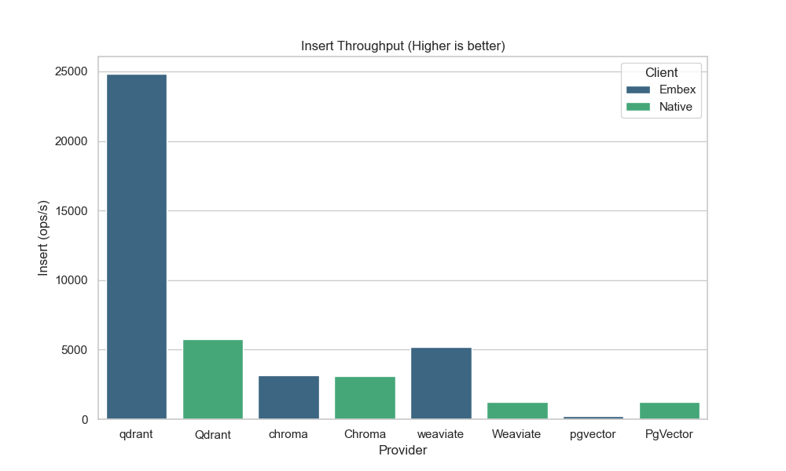
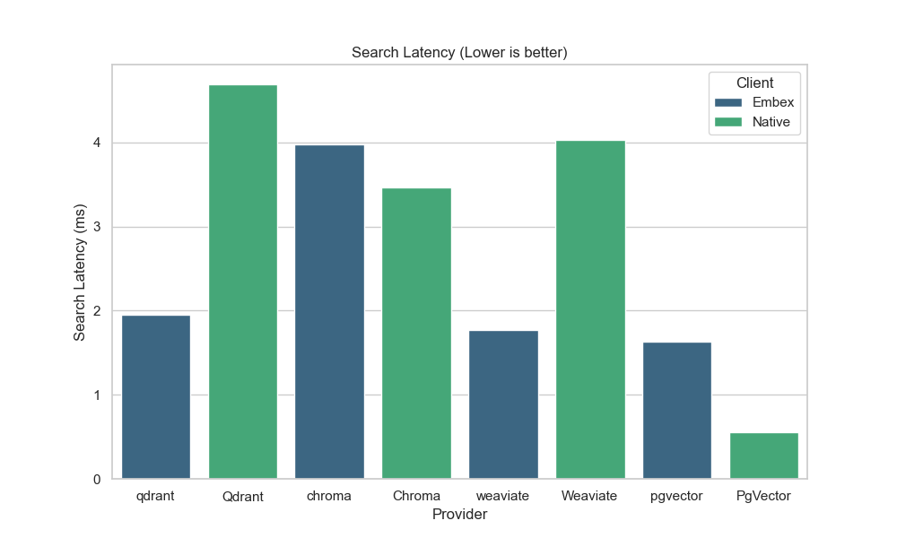

# Embex

<div align="center">

[%20%3D%20%27text%27%5D%5Blast()%5D&label=PyPI%20downloads&suffix=%2Fmonth&color=blue>)](https://pepy.tech/projects/embex)
[](https://www.npmjs.com/package/@bridgerust/embex)
[](https://github.com/bridgerust/bridgerust)
[](https://discord.gg/ZvNAeaWN)

[Why Embex?](#the-problem) - [Quick Start](#get-started-in-60-seconds) - [Docs](https://bridgerust.dev/embex) - [Discord](https://discord.gg/ZvNAeaWN) - [Examples](#what-developers-are-building)

</div>

## Also in this repository: BridgeTime (Preview)

BridgeTime is a Rust-powered Day.js/Moment-style datetime toolkit for Python and Node.js.

```bash
# Python
pip install bridgetime

# Node.js
npm install @bridgerust/bridgetime
```

BridgeTime package sources:

- `crates/bridgetime/bridge`
- `bindings/python/bridgetime`
- `bindings/node/@bridgerust/bridgetime`

## The Problem

Every vector database has a different API:

```python
# Pinecone
index.upsert(vectors=[(id, values, metadata)])
results = index.query(vector=query, top_k=5)

# Qdrant
client.upsert(collection_name=name, points=points)
results = client.search(collection_name=name, query_vector=query, limit=5)

# Weaviate
client.data_object.create(data_object, class_name)
results = client.query.get(class_name).with_near_vector(query).do()
```

Switching providers = **rewriting your entire codebase**.

## The Solution

One API. Seven databases:

```python
# Works with ANY provider
await client.collection("products").insert(vectors)
results = await client.collection("products").search(vector=query, top_k=5)
```

Switch from LanceDB to Qdrant? **Change one line**:

```diff
- client = await EmbexClient.new_async(provider="lancedb", url="./data")
+ client = await EmbexClient.new_async(provider="qdrant", url="http://localhost:6333")
```

**👇 See it in action:**

<!-- 
_(Note: Add a 10-second terminal recording showing: install → create collection → insert → search → results)_ -->

## Real Migration Example

Sarah built a RAG chatbot with Pinecone. 6 months later, costs hit $500/mo.

**With traditional clients:** 2-3 days rewriting code + testing  
**With Embex:** 2 minutes changing config

```python
# Before (Pinecone-specific)
from pinecone import Pinecone
pc = Pinecone(api_key="...")
index = pc.Index("products")

# After (Embex)
from embex import EmbexClient
client = await EmbexClient.new_async(
    provider="qdrant",  # Changed from "pinecone"
    url=os.getenv("QDRANT_URL")
)
```

**Result:** Same functionality. $450/mo saved. Zero code changes.

## Why Rust Core Matters

Pure Python/JS vector operations are slow. Embex uses Rust with SIMD acceleration:

| Operation                         | Pure Python | Embex (Rust) | Speedup  |
| --------------------------------- | ----------- | ------------ | -------- |
| Vector normalization (Batch 1000) | 45ms        | 11ms         | **4.1x** |
| Cosine similarity (Batch 1000)    | 230ms       | 58ms         | **4.0x** |
| Metadata filtering                | 180ms       | 42ms         | **4.3x** |

_Benchmarked on M1 Max, average of 1000 runs_

The difference compounds: **4x faster operations** × **thousands of vectors** = significant time saved.

## Provider Benchmarks

Real-world performance vs native Python clients (10k vectors, 384d):

| Provider     | Client    | Insert (ops/s) | Speedup  | Search Latency |
| :----------- | :-------- | :------------- | :------- | :------------- |
| **Qdrant**   | **Embex** | **24,825**     | **4.3x** | **1.95ms**     |
|              | Native    | 5,754          |          | 4.69ms         |
| **Weaviate** | **Embex** | **5,163**      | **4.1x** | **1.77ms**     |
|              | Native    | 1,256          |          | 4.03ms         |
| **Chroma**   | Embex     | 3,136          | 1.0x     | 3.97ms         |
|              | Native    | 3,077          |          | 3.46ms         |




## What Developers Are Building

🤖 **AI Chatbots with Memory**  
 Store conversation history for context-aware responses

🔍 **Semantic Search Engines**  
 Search documentation, code, or content by meaning, not keywords

🎯 **Recommendation Systems**  
 E-commerce product recommendations with embeddings

📚 **Knowledge Bases**  
 RAG systems for internal documentation and support

🎨 **Image Search**  
 Find similar images using vision embeddings

> "Embex let me prototype with LanceDB locally, then deploy to Qdrant Cloud without changing a line of code. Saved 2 days of migration work."

[Share what you built →](https://github.com/bridgerust/bridgerust/discussions)

## Get Started in 60 Seconds

**Python:**

```bash
# Install
pip install embex lancedb sentence-transformers

# Quick test
python3 << EOF
import asyncio
from embex import EmbexClient

async def main():
    client = await EmbexClient.new_async('lancedb', './data')
    print('✅ Embex ready!')

asyncio.run(main())
EOF
```

**Node.js:**

```bash
npm install @bridgerust/embex lancedb
node -e "
const {EmbexClient} = require('@bridgerust/embex');
EmbexClient.new({provider: 'lancedb', url: './data'})
  .then(() => console.log('✅ Embex ready!'));
"
```

→ **Next:** See [**Getting Started Guide**](https://bridgerust.dev/embex/quickstart)

## Embex vs. Alternatives

| Feature                           | Raw Clients | LangChain | LlamaIndex | **Embex**        |
| --------------------------------- | ----------- | --------- | ---------- | ---------------- |
| Universal API                     | ❌          | ✅        | ✅         | ✅               |
| Switch providers (0 code changes) | ❌          | ❌        | ❌         | ✅               |
| Performance (Rust core)           | ⚡ Fast     | 🐌 Slow   | 🐌 Slow    | ⚡ **4x Faster** |
| Zero Docker setup                 | Varies      | ❌        | ❌         | ✅ (LanceDB)     |
| Connection pooling                | Manual      | ❌        | ❌         | ✅               |
| Local development                 | Complex     | Complex   | Complex    | ✅ (LanceDB)     |
| Production ready                  | ✅          | ⚠️        | ⚠️         | ✅               |

**When to use each:**

- **Raw clients:** You're committed to one database forever
- **LangChain/LlamaIndex:** You need full RAG framework with LLM chains
- **Embex:** You want vector operations only, with flexibility to switch providers

## Supported Providers

LanceDB • Qdrant • Pinecone • Chroma • PgVector • Milvus • Weaviate

## Development → Production Roadmap

| Stage               | Recommendation        | Why?                                |
| :------------------ | :-------------------- | :---------------------------------- |
| **Day 1: Learning** | **LanceDB**           | Runs locally. No Docker. Free.      |
| **Week 2: Staging** | **Qdrant / Pinecone** | Managed cloud. Connection pooling.  |
| **Month 1: Scale**  | **Milvus**            | Billion-scale vectors. Distributed. |
| **Anytime**         | **PgVector**          | You already use PostgreSQL.         |

## Community

- 💬 **Discord:** Get help, share projects, discuss features → [Join Server](https://discord.gg/ZvNAeaWN)
- � **Reddit:** Join the discussion → [r/embex](https://www.reddit.com/r/embex/)
- �💡 **GitHub Discussions:** Feature requests and Q&A
- 🐛 **Issues:** Bug reports
- 📝 **Blog:** Tutorials and case studies → [bridgerust.dev/embex](https://bridgerust.dev/embex/introduction)

**Built something cool with Embex?** Share it in #showcase on Discord or tag us on Twitter!

## FAQ

**Q: How is Embex different from LangChain's VectorStores?**  
A: LangChain couples vector operations with LLM chains. Embex is vector-only, 4x faster (Rust core), and switching providers requires 0 code changes (vs. rewriting VectorStore initialization).

**Q: Does Embex support hybrid search (vector + keyword)?**  
A: Yes! Coming in v0.3. Currently supports pure vector and metadata filtering.

**Q: Can I use Embex in production?**  
A: Yes! Embex includes production features like connection pooling, automatic retries, and observability hooks. Currently used in production by developers running RAG chatbots, semantic search engines, and recommendation systems. See [deployment guide](https://bridgerust.dev/embex/deployment) for best practices.

**Q: Which provider should I start with?**  
A: LanceDB for local dev (zero setup), then Qdrant/Pinecone for production (managed, scalable).

**Q: Do you support [X database]?**  
A: Current: LanceDB, Qdrant, Pinecone, Chroma, PgVector, Milvus, Weaviate. Roadmap: Elasticsearch, OpenSearch, Redis. [Request here](https://github.com/bridgerust/bridgerust/issues).

## Installation

### Python

```bash
pip install embex
```

### Node.js

```bash
npm install @bridgerust/embex
```

### Rust (Development)

```toml
[dependencies]
bridge-embex = { git = "https://github.com/bridgerust/bridgerust", path = "crates/embex/client" }
```

## Features

- **Universal API**: Switch providers without code changes
- **High Performance**: Rust core with SIMD acceleration (4x faster)
- **Zero Setup**: Start with LanceDB (embedded, local)
- **Production Ready**: Connection pooling, migrations, observability

## Documentation

- [**Getting Started**](https://bridgerust.dev/embex/quickstart)
- [**API Reference**](https://bridgerust.dev/embex/api-reference)
- [**Providers Guide**](https://bridgerust.dev/embex/providers)

## 🚀 Next Steps

1. ⭐ **Star this repo** if Embex saves you time
2. 💬 **Join Discord** for help and to share what you build
3. 📖 **Try the tutorial:** [Build a chatbot in 10 minutes](https://bridgerust.dev/embex/tutorial)

**Quick links:**

- [Installation Guide](https://bridgerust.dev/embex/installation)
- [Python API Docs](https://bridgerust.dev/embex/api/python) • [Node.js API Docs](https://bridgerust.dev/embex/api/nodejs)
- [Migration Examples](https://bridgerust.dev/embex/migrations)
- [Performance Benchmarks](https://bridgerust.dev/embex/benchmarks)

## BridgeRust Framework

This repository also contains the **BridgeRust** framework - a unified system for building cross-language Rust libraries. Embex is built with BridgeRust.

### Packages & Status

| Crate                                             | Version                                                                                                           | Downloads                                                                                                         | Docs                                                                                                    |
| :------------------------------------------------ | :---------------------------------------------------------------------------------------------------------------- | :---------------------------------------------------------------------------------------------------------------- | :------------------------------------------------------------------------------------------------------ |
| **[bridgerust](crates/bridgerust)**               | [](https://crates.io/crates/bridgerust)               | [](https://crates.io/crates/bridgerust)               | [](https://bridgerust.dev/bridgerust/introduction) |
| **[bridgerust-macros](crates/bridgerust-macros)** | [](https://crates.io/crates/bridgerust-macros) | [](https://crates.io/crates/bridgerust-macros) | [](https://docs.rs/bridgerust-macros)            |
| **[bridge (CLI)](cli/bridge)**                    | [](https://crates.io/crates/bridge)                       | [](https://crates.io/crates/bridge)                       | -                                                                                                       |

### Framework Documentation

- [Quick Reference](docs/QUICK_REFERENCE.md)
- [Getting Started Guide](docs/getting-started-bridgerust.md)
- [Migration Guide](docs/MIGRATION_GUIDE.md)
- [Examples](docs/EXAMPLES.md)
- [Troubleshooting](docs/TROUBLESHOOTING.md)
- [Comprehensive Example](examples/bridgerust-example/)

## Contributing

See [CONTRIBUTING.md](docs/CONTRIBUTING.md) for development setup and guidelines.

## License

MIT OR Apache-2.0

[](LICENSE)
